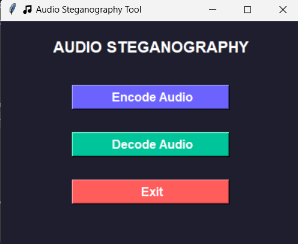

Audio Steganography using Image 🖼

This project hides an audio file inside an image using steganography techniques, ensuring secure and covert communication.
It also provides a Tkinter-based GUI for easy encoding and decoding operations.

---

 Overview

Steganography is the art of hiding information within other files so that the existence of the hidden data is concealed.
In this project, an audio file (e.g., MP3/WAV) is encoded within an image (e.g., PNG) using Least Significant Bit (LSB) encoding.
Later, the hidden audio can be extracted (decoded) back from the image.

---

 Features

 Hide audio data inside an image (encoding)

 Retrieve hidden audio from a stego-image (decoding)

 User-friendly GUI built with Tkinter

 Works with MP3/WAV audio formats and PNG images

 Demonstrates real-world data hiding for secure communication

---

 Installation & Setup

1. Clone the Repository

2. Install Dependencies

pip install -r requirements.txt

3. Run the Application

python audio_steganography_gui.py

---

 How It Works

 Encoding Process

1. The image is converted into an array of pixels.

2. The audio file is read and converted into binary data.

3. Each bit of the audio data is hidden in the least significant bit (LSB) of the image pixels.

4. The modified image (stego-image) is saved.

 Decoding Process

1. The stego-image is analyzed pixel by pixel.

2. The LSBs are extracted and combined to reconstruct the original binary data.

3. The audio file is recreated and saved.

---

 GUI Preview

Encode Tab: Choose an image and audio file, then save the stego-image.

Decode Tab: Select a stego-image to extract the hidden audio file.

(Add a screenshot here if available)

---

 Requirements

Python 3.8+

Tkinter (comes with Python)

Numpy

Pillow (PIL)

Pydub

FFmpeg (for audio conversion support)

Install FFmpeg:

Windows: Download FFmpeg → add bin/ to your system PATH

Linux/macOS:

sudo apt install ffmpeg

---

⚠ Notes

Make sure the image is large enough to store the entire audio file.

If the audio is too big, try compressing or using a larger image.

Always test encoding and decoding on the same system environment for consistent results.

If audio fails to decode, verify FFmpeg is properly installed.

---

 Future Enhancements

Add encryption + steganography hybrid for stronger security

Support for video or text data hiding

Use Deep Learning for adaptive steganography

---

 Author

Riddhi Manjrekar
